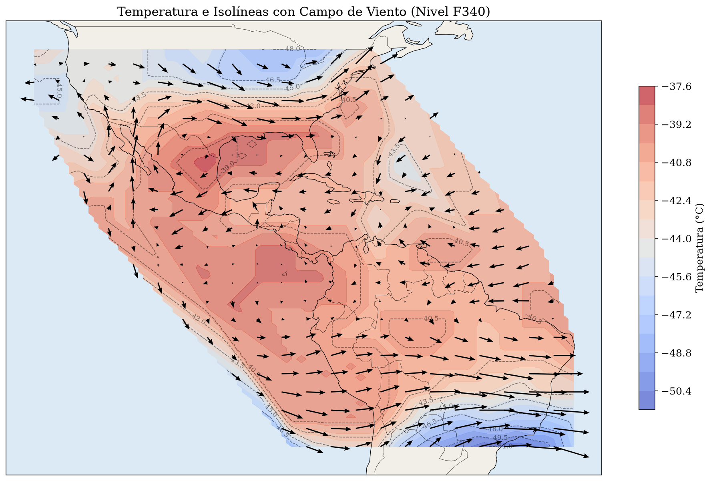

# Visualización y Modelado del Campo de Viento WINTEM (Nivel F340) 🌬️✈️

Este proyecto desarrolla un sistema de procesamiento y visualización computacional para el **campo de viento meteorológico WINTEM** a un nivel de vuelo F340 (34,000 pies) sobre Sudamérica. Fue desarrollado como el **Trabajo Final para el curso de Modelos Matemáticos para la Ciencia III** en la E.P. de Computación Científica - UNMSM (Ciclo 2026-I).

## 🚀 El Problema Científico

En la aviación y la meteorología, interpretar grandes volúmenes de datos tabulares en tiempo real es crítico. Este proyecto toma datos sin procesar (`F340_Data.csv`) y los transforma en mapas dinámicos interactivos, permitiendo analizar variables atmospheric clave para la navegación aérea:
1. **Dirección y Magnitud del Viento:** Representados mediante vectores proporcionales.
2. **Campos Scalar:** Superposición de contornos de **Temperatura (°C)** y **Vorticidad** atmosférica.

## 📊 Visualización de Resultados

## 🛠️ Tecnologías y Librerías Utilizadas

* **Lenguaje:** Python 3.12 (Ejecutado sobre entorno virtualizado en WSL Ubuntu)
* **Procesamiento de Datos:** `numpy`, `pandas`, `scipy`
* **Geoprocesamiento y Mapas:** `Cartopy` (para proyecciones cartográficas y fronteras políticas)
* **Visualización Avanzada:** `matplotlib` (uso de `quiver` para vectores y `contour`/`contourf` para isolíneas)

## 📁 Estructura del Repositorio

* `/notebooks`: Contiene el desarrollo interactivo paso a paso (`TrabajoFinalGrupo2-MMCIII.ipynb`).
* `/data`: Archivos fuente de datos atmosféricos (`F340_Data.csv`).
* `/reportes`: Gráficos exportados y documentación analítica.

---
**Integrantes del Grupo 2:** Enrique Julca Delgado, Diana Patricia Alba Pérez, José Alexis Delgado Pérez.